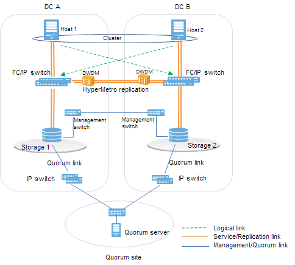

Huawei Dorado replication
*************************

Introduction
============

Huawei Dorado arrays implement block level data replication between 2 arrays. This product is called HyperMetro Replication. This feature allow opensvc agent to provision and operate services using a synchronously replicated lun that is readable and writable from both arrays at the same time.

This kind of service is often used to build metrocluster or geocluster systems, drastically lowering time needed to relocate production to another location, with application level granularity, and improving overall IT availability. The following documentation presents the configuration of such a service. This setup just require using the OpenSVC agent, which is free of charge.

Configuration
=============

Pre-requisites
--------------

* 2 Unix servers with OpenSVC agents, assembled into a 2-nodes cluster
* 2 Huawei Dorado arrays, configured with "HyperMetro Replication" license
* A storage pool has been created on both storage systems.
* Dual fabric storage area network, each server is zoned to each array
* 2 luns :

  * R1 in dorado array located in datacenter 1 (DC1)
  * R2 in dorado array located in datacenter 2 (DC2)
  * R1 and R2 are paired through a HyperMetro replication configuration, exposing the same external device identity (geometry, device WWN).
  * R1 is the preferred lun for io, and R2 is the non preferred lun
  * Both servers see the R1, R2 pair as a single lun, which is read/write enabled at a same time, on both arrays

* User account (login/password) with "SAN resource administrator" role, in each dorado array, to be able to authenticate on array api

Agent configuration file
------------------------

First of all, we need to tell OpenSVC agents how to connect Huawei Dorado array. It's better to use cluster configuration file to describe the connection informations to each array.

The following configuration describes our 2 arrays:

Array Configuration (extract of cluster.conf)
---------------------------------------------

::

	[array#dc1]
	name = 2102352VUV10KA000002
	type = dorado
	api = https://10.11.0.231:8088/
	username = opensvc
	password = system/sec/dorado
	
	[array#dc2]
	name = 2102352VUV10KA000003
	type = dorado
	api = https://10.11.0.238:8088/
	username = opensvc
	password = system/sec/dorado

* 2 arrays declared (dc1, dc2)
* the array ``name`` must match the equipment serial number (cli command ``showsystemgeneral``, or trough device manager using the "home" button)
* ``type`` tells opensvc agent which storage array driver to use
* ``username`` is used to specify the login account created in the storage array, which is ``opensvc``
* ``password`` is the name of opensvc cluster secret object used to store the array password

.. note:: to store the password ``D0r@d0`` in opensvc secret ``system/sec/dorado``, use the following commands
          ``om system/sec/dorado create ; om system/sec/dorado add --key password --value D0r@d0``

Example commands
----------------

:cmd:`om array --array 2102352VUV10KA000002 --help`
    List command options exposed in dorado array driver

:cmd:`om array --array 2102352VUV10KA000002 list storagepool`
    List array storage pools

:cmd:`om array --array 2102352VUV10KA000002 list fc port`
    List array fibre channel ports

:cmd:`om array --array 2102352VUV10KA000002 list sas port`
    List array sas ports

:cmd:`om array --array 2102352VUV10KA000002 list eth port`
    List network ports

:cmd:`om array --array 2102352VUV10KA000002 add lun --name test3 --size 1g --storagepool StoragePool001`
    Create a single ``1GiB`` lun named ``test3`` in ``StoragePool001`` storage pool

:cmd:`om array --array 2102352VUV10KA000002 add lun --name test3 --size 1g --storagepool StoragePool001 --compression --dedup`
    Create a single ``1GiB`` deduped and compressed lun named ``test3`` in ``StoragePool001`` storage pool

:cmd:`om array --array 2102352VUV10KA000002 list mappings --name test3`
   list host mappings for lun 

:cmd:`om array --array 2102352VUV10KA000002 list fc ports | grep -i wwn`
   query fc ports wwpn

:cmd:`om array --array 2102352VUV10KA000002 list host link | grep -E "INITIATOR_PORT_WWN|TARGET_PORT_WWN|NAME"`
   list host to fc port connections

:cmd:`om array --array 2102352VUV10KA000002 list lun | grep -Ew "NAME|WWN"`
   list luns and its wwn

:cmd:`om array --array 2102352VUV10KA000002 map --naa 6cc64a61008314970b9de1090000004e --mappings 2100f4e9d45585c9:2010cc64a6831497 --mappings 2100f4e9d45585c9:2000cc64a6831497 --mappings 2100f4e9d4548daf:2000cc64a6831497 --mappings 2100f4e9d4548daf:2010cc64a6831497`
   maps lun (hostlunid autoassignment)

:cmd:`om array --array 2102352VUV10KA000002 map --naa 6cc64a61008314970b9de1090000004e --mappings 2100f4e9d45585c9:2010cc64a6831497 --mappings 2100f4e9d45585c9:2000cc64a6831497 --mappings 2100f4e9d4548daf:2000cc64a6831497 --mappings 2100f4e9d4548daf:2010cc64a6831497 --lun 123`
   maps lun (hostlunid=123) 

:cmd:`om array --array 2102352VUV10KA000002 map --name test3 --mappings 2100f4e9d45585c9:2010cc64a6831497 --mappings 2100f4e9d45585c9:2000cc64a6831497 --mappings 2100f4e9d4548daf:2000cc64a6831497 --mappings 2100f4e9d4548daf:2010cc64a6831497 --lun 123`
   maps lun using its name (hostlunid=123) 

:cmd:`om array --array 2102352VUV10KA000002 list_mappings --name test3`
   list lun mappings

:cmd:`om array --array 2102352VUV10KA000002 del disk --name test3`
   delete lun (if mapped, first unmap it)

Pool Configuration (extract of cluster.conf)
--------------------------------------------

::

	[pool#dorado]
	type = dorado
	array = 2102352VUV10KA000002
	diskgroup = StoragePool001
	
	[pool#replicated]
	type = dorado
	array@ubuntu1 = 2102352VUV10KA000002
	array@ubuntu2 = 2102352VUV10KA000003
	diskgroup = StoragePool001
	hypermetrodomain = HyperMetroDomain_000

* pool named ``dorado`` is local to array ``2102352VUV10KA000002``, and points to dorado storage pool ``StoragePool001``
* pool named ``replicated`` rely on both arrays using ``HyperMetroDomain_000`` HyperMetro domain, to automate the creation of replicated luns

Pool Usage
==========

Local pool
----------

1 disk, 1 node
~~~~~~~~~~~~~~

The following describes a simple lun creation, provisioned from a local, non-replicated pool

* create lun in array
* map lun to server ubuntu1
* scsi bus scan
* instantiate opensvc volume object

``2GiB`` lun named ``tstpool1`` is created using storagepool ``dorado`` ::

	root@ubuntu1:~# om pool create vol --pool dorado --name tstpool1 --size 2g --blk
	@ n:ubuntu1
	  create volume vol/tstpool1 (pool name: dorado, pool type: dorado, access: rwo, size: 2g, format: False, nodes: , shared: False)
	@ n:ubuntu1 o:vol/tstpool1
	  allocated rid disk#1
	  vol/tstpool1 target state set to provisioned

.. note::

       The ``--blk`` option disable the disk formatting, and filesystem mount. This option should be used for applications which disk access requirement is raw, like Oracle ASM, SAP Sybase IQ, GlusterFS, ...

A new ``vol/tstpool1`` volume object is configured ::

	root@ubuntu1:~# om vol/* ls
	vol/foo
	vol/mvol1
	vol/tstpool1

The ``vol/tstpool1`` volume object is presented to the node, and had scsi3 reservation enabled ::

	root@ubuntu1:~# om vol/tstpool1 print status
	vol/tstpool1                     up                                                           
	`- instances            
	   `- ubuntu1                    up         idle, started 
	      |- disk#1         ........ n/a        disk 6cc64a61008314970bd4f5ea00000052             
	      `- disk#1pr       ........ up         /dev/sdah, /dev/sdaj, /dev/sdal, /dev/sdan        

The lun is presented through all array frontends known by server ``ubuntu1`` ::

	root@ubuntu1:~# multipath -l /dev/mapper/36cc64a61008314970bd4f5ea00000052
	36cc64a61008314970bd4f5ea00000052 dm-7 HUAWEI,XSG1
	size=2.0G features='0' hwhandler='0' wp=rw
	`-+- policy='round-robin 0' prio=0 status=active
	  |- 18:0:2:6    sdah 66:16  active undef unknown
	  |- 16:0:2:6    sdal 66:80  active undef unknown
	  |- 18:0:3:6    sdaj 66:48  active undef unknown
	  `- 16:0:3:6    sdan 66:112 active undef unknown

The ``vol/tstpool1`` object configuration is as below ::

	root@ubuntu1:~# om vol/tstpool1 print config
	[DEFAULT]
	pool = dorado
	size = 2147483648
	access = rwo
	id = fde92dfd-faef-467f-80aa-8e7772ac2c62
	
	[disk#1]
	type = disk
	name = tstpool1.root.vol.hwcl1
	scsireserv = True
	shared = False
	size = 2147483648
	disk_id@ubuntu1 = 6cc64a61008314970bd4f5ea00000052
	
	[sync#i0]
	disable = True
	
2 dedicated disks, 2 nodes
~~~~~~~~~~~~~~~~~~~~~~~~~~
	
2 x ``5GiB`` luns named ``tstavn1`` are created using storagepool ``dorado``. Present lun 1 to ubuntu1, present lun 2 to ubuntu2 ::

	root@ubuntu1:~# om pool create vol --pool dorado --name tstavn1 --size 5g --nodes '*' --blk
	@ n:ubuntu1
	  create volume vol/tstavn1 (pool name: dorado, pool type: dorado, access: rwo, size: 5g, format: False, nodes: *, shared: False)
	@ n:ubuntu1 o:vol/tstavn1
	  allocated rid disk#1
	  vol/tstavn1 target state set to provisioned

.. note::

       Lun naming inside array is suffixed with the server hostname which owns the disk (``tstavn1.root.vol.hwcl1.ubuntu1``)
       ``tstavn1`` is the disk name.
       ``root`` is the opensvc namespace.
       ``vol`` is the object kind.
       ``hwcl1`` is the opensvc cluster name.
       ``ubuntu1`` is the server name owning the disk.

Same ``vol/tstavn1`` object name accross opensvc cluster, but different lun wwn on each server ::
	
	root@ubuntu1:~# om vol/tstavn1 print config
	[DEFAULT]
	pool = dorado
	size = 5368709120
	access = rwo
	nodes = *
	id = 470690fd-82da-44b3-9a1d-4a50b6c4f09b
	
	[disk#1]
	type = disk
	name = tstavn1.root.vol.hwcl1
	scsireserv = True
	shared = False
	size = 5368709120
	disk_id@ubuntu1 = 6cc64a61008314970cccd41900000058
	disk_id@ubuntu2 = 6cc64a61008314970cccdd1f00000059
	
	
1 shared disk, 2 nodes
~~~~~~~~~~~~~~~~~~~~~~

``10GiB`` lun named ``tstavn2`` is created using storagepool ``dorado``. Present lun to ubuntu1 and ubuntu2 ::

	root@ubuntu1:~# om pool create vol --pool dorado --name tstavn2 --size 10g --nodes '*' --shared --blk
	@ n:ubuntu1
	  create volume vol/tstavn2 (pool name: dorado, pool type: dorado, access: rwo, size: 10g, format: False, nodes: *, shared: True)
	@ n:ubuntu1 o:vol/tstavn2
	  allocated rid disk#1
	  vol/tstavn2 target state set to provisioned
	
``vol/tstavn2`` object shows same lun wwn on both servers ::

	root@ubuntu1:~# om vol/tstavn2 print config
	[DEFAULT]
	pool = dorado
	size = 10737418240
	access = rwo
	nodes = *
	id = c12d2610-cdf9-445b-8969-5296fff9484c
	
	[disk#1]
	type = disk
	name = tstavn2.root.vol.hwcl1
	scsireserv = True
	shared = True
	size = 10737418240
	disk_id = 6cc64a61008314970cd01f270000005a
	
	[sync#i0]
	disable = True

Replicated Pool
---------------

1 replicated disk, 1 node
~~~~~~~~~~~~~~~~~~~~~~~~~

``1GiB`` lun named ``rep1`` is created using storagepool ``replicated`` ::

	root@ubuntu1:~# om pool create vol --pool replicated --name rep1 --size 1g --blk
	@ n:ubuntu1
	  create volume vol/rep1 (pool name: replicated, pool type: dorado, access: rwo, size: 1g, format: False, nodes: , shared: False)
	@ n:ubuntu1 o:vol/rep1
	  allocated rid disk#1
	  vol/rep1 target state set to provisioned

.. note:: Disk will be named ``rep1.root.vol.hwcl1.ubuntu1`` inside dorado arrays

The ``vol/rep1`` volume object is presented to the node, and had scsi3 reservation enabled on 8 paths ::

	root@ubuntu1:~# om vol/rep1 print status
	vol/rep1                         up                                                                                                
	`- instances            
	   `- ubuntu1                    up         idle, started                                      
	      |- disk#1         ........ n/a        disk 6cc64a61008314970cd29b080000005b                                                  
	      `- disk#1pr       ........ up         /dev/sdat, /dev/sdau, /dev/sdav, /dev/sdaw, /dev/sdax, /dev/sday, /dev/sdaz, /dev/sdba 
	
The lun is presented through all array frontends known by server ``ubuntu1``. 4 paths to local preferred array ``status=active``. 4 paths to remote non-preferred array ``status=enabled`` ::

	root@ubuntu1:~# multipath -l /dev/sdat
	36cc64a61008314970cd29b080000005b dm-10 HUAWEI,XSG1
	size=1.0G features='0' hwhandler='0' wp=rw
	|-+- policy='round-robin 0' prio=0 status=active
	| |- 18:0:2:8 sdat 66:208 active undef unknown
	| |- 16:0:2:8 sdax 67:16  active undef unknown
	| |- 18:0:3:8 sdau 66:224 active undef unknown
	| `- 16:0:3:8 sday 67:32  active undef unknown
	`-+- policy='round-robin 0' prio=0 status=enabled
	  |- 18:0:5:4 sdaw 67:0   active undef unknown
	  |- 16:0:5:4 sdba 67:64  active undef unknown
	  |- 18:0:4:4 sdav 66:240 active undef unknown
	  `- 16:0:4:4 sdaz 67:48  active undef unknown
	
The ``vol/rep1`` object configuration is as below ::
	
	root@ubuntu1:~# om vol/rep1 print config
	[DEFAULT]
	pool = replicated
	size = 1073741824
	access = rwo
	id = 383c4caf-f975-4c86-a386-f67bd360c59a
	
	[disk#1]
	type = disk
	name = rep1.root.vol.hwcl1
	scsireserv = True
	shared = False
	size = 1073741824
	disk_id@ubuntu1 = 6cc64a61008314970cd29b080000005b
	
	[sync#i0]
	disable = True
	
	
1 shared replicated disk, 1 node
~~~~~~~~~~~~~~~~~~~~~~~~~~~~~~~~

``1GiB`` lun named ``rep2`` is created using storagepool ``replicated`` and marked as shared ::

	root@ubuntu1:~# om pool create vol --pool replicated --name rep2 --size 1g --shared --blk
	@ n:ubuntu1
	  create volume vol/rep2 (pool name: replicated, pool type: dorado, access: rwo, size: 1g, format: False, nodes: , shared: True)
	@ n:ubuntu1 o:vol/rep2
	  allocated rid disk#1
	  vol/rep2 target state set to provisioned
	
.. note:: Due to ``--shared`` option, disk will be named ``rep2.root.vol.hwcl1`` inside dorado arrays, supposed to be presented later to another node

The ``vol/rep2`` object configuration is as below ::

	root@ubuntu1:~# om vol/rep2 print config
	[DEFAULT]
	pool = replicated
	size = 1073741824
	access = rwo
	id = 9da6563d-6759-418f-a947-55e9c73a364e
	
	[disk#1]
	type = disk
	name = rep2.root.vol.hwcl1
	scsireserv = True
	shared = True
	size = 1073741824
	disk_id = 6cc64a61008314970cd58f260000005c
	
	[sync#i0]
	disable = True
	
The lun is presented through all array frontends known by server ``ubuntu1``. 4 paths to local preferred array ``status=active``. 4 paths to remote non-preferred array ``status=enabled`` ::

	root@ubuntu1:~# multipath -l /dev/mapper/36cc64a61008314970cd58f260000005c
	36cc64a61008314970cd58f260000005c dm-11 HUAWEI,XSG1
	size=1.0G features='0' hwhandler='0' wp=rw
	|-+- policy='round-robin 0' prio=0 status=active
	| |- 18:0:2:10 sdbb 67:80  active undef unknown
	| |- 16:0:2:10 sdbf 67:144 active undef unknown
	| |- 18:0:3:10 sdbc 67:96  active undef unknown
	| `- 16:0:3:10 sdbg 67:160 active undef unknown
	`-+- policy='round-robin 0' prio=0 status=enabled
	  |- 18:0:4:5  sdbd 67:112 active undef unknown
	  |- 16:0:5:5  sdbi 67:192 active undef unknown
	  |- 18:0:5:5  sdbe 67:128 active undef unknown
	  `- 16:0:4:5  sdbh 67:176 active undef unknown
	
	
1 shared replicated disk, 2 nodes
~~~~~~~~~~~~~~~~~~~~~~~~~~~~~~~~~

``1GiB`` lun named ``rep4`` is created using storagepool ``replicated``, marked as shared, and presented to all cluster nodes ::

	root@ubuntu1:~# om pool create vol --pool replicated --name rep4 --size 1g --shared --nodes '*' --blk
	@ n:ubuntu1
	  create volume vol/rep4 (pool name: replicated, pool type: dorado, access: rwo, size: 1g, format: False, nodes: *, shared: True)
	@ n:ubuntu1 o:vol/rep4
	  allocated rid disk#1
	  vol/rep4 target state set to provisioned

The ``vol/rep4`` volume object is presented to the node, and had scsi3 reservation enabled on 8 paths ::

	root@ubuntu1:~# om vol/rep4 print status 
	vol/rep4                         up                                                                                                
	`- instances            
	   |- ubuntu2                    down       idle                                                                 
	   `- ubuntu1                    up         idle, started                                      
	      |- disk#1         ........ n/a        disk 6cc64a61008314970cd7b64b0000005e                                                  
	      |- disk#1pr       ........ up         /dev/sdbr, /dev/sdbs, /dev/sdbt, /dev/sdbu, /dev/sdbv, /dev/sdbw, /dev/sdbx, /dev/sdby 
	      `- sync#i0        ..DO./.. n/a        rsync svc config to nodes                                                              
	
The ``vol/rep4`` object configuration is as below ::

	root@ubuntu1:~# om vol/rep4 print config
	[DEFAULT]
	pool = replicated
	size = 1073741824
	access = rwo
	nodes = *
	id = 94add459-0d08-4e4d-b64f-a9bd9439202b
	
	[disk#1]
	type = disk
	name = rep4.root.vol.hwcl1
	scsireserv = True
	shared = True
	size = 1073741824
	disk_id = 6cc64a61008314970cd7b64b0000005e
	
	[sync#i0]
	disable = True

Service Usage
=============

The most common usage of opensvc dorado driver is through opensvc service provisioning, using a volume object :

A service object is created in cluster ::

	SVC=svctest
	om $SVC create

The ``env`` section in service object is set to point to cluster pool named ``replicated`` ::

	om $SVC set --kw env.size=3G --kw env.pool=replicated

The service is configured to run on all cluster nodes, automatically being orchestrated by opensvc ::

	om $SVC set --kw nodes='*' --kw orchestrate=ha

The volume object is configured into opensvc service ::

	om $SVC set --kw volume#1.name={svcname} --kw volume#1.pool={env.pool} --kw volume#1.size={env.size} --kw volume#1.shared=true

.. note:: The pool name, and volume sized points to ``env`` section where those parameters have been set at the previous step

A simple application is added to the service ::

	om $SVC set --kw app#0.type=simple --kw='app#0.start=/usr/bin/python3 -m http.server {env.port}' --kw app#0.cwd=/tmp --kw env.port=8000

Service is now ready to be provisioned ::

        om $SVC provision

To make copy/paste easy, all commands are below::

        SVC=svctest
        om $SVC create
        om $SVC set --kw env.size=3G --kw env.pool=replicated --kw nodes='*' --kw orchestrate=ha
        om $SVC set --kw volume#1.name={svcname} --kw volume#1.pool={env.pool} --kw volume#1.size={env.size} --kw volume#1.shared=true
        om $SVC set --kw app#0.type=simple --kw='app#0.start=/usr/bin/python3 -m http.server {env.port}' --kw app#0.cwd=/tmp --kw env.port=8000
        om $SVC provision

