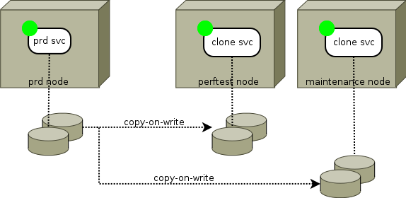

IBM DS flash copy
*****************************

Introduction
============

IBM Flash copy allow multi-target block device replication. After create initial flash copy, the relation can persist. These features allow opensvc to drive services using a flash copy device set. Such services are often used for maintenance, pre-production and performance testing environments, where the source device set is used for production. The following documentation presents the configuration of such a service.

A service with only flash copy sync resources can be defined to drive the clone of other servers, just for the benefit of centralized logging and scheduling.

Command set
===========

:cmd:`syncresync`
	* Resyncflash (or rmflash/mkflash) action to pair source/target. This command verifies the service is down before proceeding.

:cmd:`syncresync --force`
	* Bypass the sync_min_delay protection.

Status
======

:state:`up`
	* The last resync occured less than 'sync_max_delay' minutes ago.

:state:`warn`
	* The last replication occured more than ‘sync_max_delay’ minutes ago.
	* Device are in a unexpected state or not present in the flash copy persistent pair list.

Service configuration
=====================

Pre-requisites
--------------

The dscli commands must be installed in the standard location on the nodes running this service resource type.

An ``<OSVCETC>/auth.conf`` must exist and contain credentials to access the manager for each array. The agent enforce this file permissions is 600 and is owned by root.

Example auth.conf:

::

	[IBM.XXXX-XXXXXXX]
	type = ibmds
	hmc1 = 10.10.10.10
	hmc2 =
	username = opensvc

Use dscli commands to create pwfile in <OSVCVAR>. The pwfile's name must be the same as the array. For exemple ``<OSVCVAR>/IBM.XXXX-XXXXXXX.pwfile``.

Example:

::

	dscli managepwfile -action add -mc1 1.2.3.4 -mc2 1.2.3.5
	                   -pwfile /var/lib/opensvc/IBM.2107-00AAA00.pwfile
	                   -name opensvc -pw xxx

Service configuration file
--------------------------

::

	#
	# IBM flash copy
	#
	;[sync#1]
	;type = ibmdssnap
	;sync_max_delay = 10512000
	
	#
	# 'array'
	# mandatory. The name of the IBM storage array, as seen by the manager.
	# Also used in etc/auth.conf
	#
	;array = IBM.XXXX-XXXXXXX
	
	#
	# ‘pairs’
	# mandatory. whitespace-separated list of device pairs (source/target) to drive with this ressource.
	# 
	;pairs = 0001:0002 0101:0102 0003:0004
	
	#
	# ‘bgcopy’
	# optional. Default True. 
	# After background copy, all track are available to the target.
	# If False, array wait write on source track to copy delta on the target. In this case, read a no copied track on the target is read on the source. 
	;bgcopy = true
	
	#
	# ‘recording’
	# optional. Default True. The recording target allow resyncs delta-based and restore delta only. One recording target is possible.
	#
	;recording = true
	
	# flash copy with recording and bgcopy options looks like delta-based clone feature
	# flash copy without recording and bgcopy options looks like snapshot feature
	# flash copy without recording option but with bgcopy option looks like full copy feature
	
You can setup as many sync resources as needed to ensure a consistent replication scenario.

IBM DS flash copy configuration
===============================

You have to create the persistent flash copy manually once. This requires two existing devices.

Examples
========

Resync a started service snapshots
----------------------------------

::

	# svcmgr -s iiststibmds stop && \
          svcmgr -s iiststibmds sync resync && \
          svcmgr -s iiststibmds start

Resync a stopped service snapshots
----------------------------------

::

	# svcmgr -s iiststibmds syncresync
	2014-09-18 23:04:02,189 - IISTSTIBMDS.SYNC#1 - INFO - resyncflash - dev IBM.XXXX-XXXXXXX -persist -record -cp 0001:0002 0101:0102 0003:0004 | /opt/ibm/dscli/dscli -hmc1 10.10.10.10 -user opensvc -pwfile /var/lib/opensvc/IBM.XXXX-XXXXXXX.pwfile
	2014-09-18 23:04:05,621 - IISTSTIBMDS.SYNC#1 - INFO - Date/Time: September 18, 2014 11:04:04 PM CEST IBM DSCLI Version: 7.7.10.317 DS: IBM.XXXX-XXXXXXX
	
	 Date/Time: September 18, 2014 11:04:04 PM CEST IBM DSCLI Version: 7.7.10.317 DS: IBM.XXXX-XXXXXXX
	
	CMUC00168I resyncflash: FlashCopy volume pair 0001:0002 successfully resynchronized.
	CMUC00168I resyncflash: FlashCopy volume pair 0101:0102 successfully resynchronized.
	CMUC00168I resyncflash: FlashCopy volume pair 0003:0004 successfully resynchronized.
