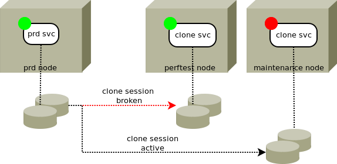

Symmetrix clones
****************

Introduction
============

EMC Symmetrix arrays clones allow multi-target block device replication, splitting a set of cloned devices, resyncing and merging changes on a clone set to its source set. After the initial full copy, all resyncs are delta-based. These excellent features allow opensvc to drive services using a cloned device set, handling the splitting on start-up and providing a simple command for resync and merge-back. This kind of services are often used for maintenance, pre-production, performance testing environments, where the source device set is used for production. The following documentation presents the configuration of such a service.

A service with only symclone sync resource can be defined to drive the clone of other servers, just for the benefit of centralised logging and scheduling.

Command set
===========

:command:`syncbreak`
    Activate the resource devices, breaking the data-replication. The source starts to log differences. The devices are promoted to read-write access.

:command:`syncresync`
    Re-establish the resource devices replication. This command verifies the service is down before proceeding.

Status
======

:command:`up`
    The last replication occured less than 'sync_max_delay' minutes ago.

:command:`warn`
    The last replication occured more than 'sync_max_delay' minutes ago.

:command:`down`
    Device are in a unexpected state or not present in the resource symmetrix disk group.

Service configuration
=====================

Pre-requisites
--------------

The symcli commands must be installed in the standard location on the nodes running this service resource type.

Service configuration file
--------------------------

::

	#
	# Symmetrix clones
	#
	;[sync#2]
	;type = symclone

	#
	# 'symdg'
	#   mandatory. name of the symmetrix device group where the source and target
	#   devices are grouped.
	#
	;symdg = DGCVI

	#
	# 'precopy_timeout'
	#   optional. default 300 secs. seconds to wait for a precopy (syncresync) to
	#   finish before returning with an error. In this case, the precopy proceeds
	#   normally, but the opensvc leftover actions must be retried. The precopy
	#   time depends on the amount of changes logged at the source, which is
	#   context-dependent. Tune to your needs.
	#
	;precopy_timeout = 300

	#
	# 'symdevs'
	# 'symdevs@node'
	#   mandatory. whitespace-separated list of devices to drive with this resource.
	#   devices are specified as 'symmetrix identifier:symmetrix device identifier'
	#
	;symdevs@node109 = 000290101370:380D
	;sync_min_delay = 30
	;sync_max_delay = 1440

You can setup as many sync resources as needed to ensure a consistent replication scenario. For example, you might want to clone an Oracle database data first, then in a subsequent sync, clone the archivelogs.

Symmetrix clone configuration
=============================

Create a symmetrix disk group
-----------------------------

::

	# symdg create -type REGULAR DGCVI

Add source devices to the group
-------------------------------

::

	# symld -g DGCVI add dev 1234 DEV001

Add target devices to the group
-------------------------------

::

	# symld -g DGCVI add dev 4321 CLONE001

Start the initial copy
----------------------

::

	# symclone -g DGCVI create -diff -precopy DEV001 sym ld CLONE001  # [more pairs...]

Examples
========

Resync service clones
---------------------

::

	# /opt/opensvc/etc/aastmphpux syncresync                                                                                           
	* IISTMPHPUX.SYNC#2 - INFO - /usr/symcli/bin/symclone -g DGCVI -noprompt recreate -precopy -i 20 -c 30 DEV001 sym ld CLONE001
	* IISTMPHPUX.SYNC#2 - WARNING - command succesful but stderr

	'Recreate' operation execution is in progress for device 'DEV001'
	paired with target device 'CLONE001' in
	device group 'DGCVI'. Please wait...

	'Recreate' operation successfully initiated for device 'DEV001'
	in group 'DGCVI' paired with target device 'CLONE001'.

Start a service using clones
----------------------------

::

	# /opt/opensvc/etc/aastmphpux start                                                                                                
	* IISTMPHPUX.IP#1 - INFO - ifconfig lan900:1 192.168.32.41 netmask 255.255.252.0 up
	* IISTMPHPUX.IP#1 - WARNING - arp annouce skipped. install 'arping'
	* IISTMPHPUX.SYNC#2 - INFO - /usr/symcli/bin/symclone -g DGCVI -noprompt activate -i 20 -c 30 DEV001 sym ld CLONE001
	* IISTMPHPUX.SYNC#2 - WARNING - command succesful but stderr

	'Activate' operation execution is in progress for device 'DEV001'
	paired with target device 'CLONE001' in
	device group 'DGCVI'. Please wait...

	'Activate' operation successfully executed for device 'DEV001'
	in group 'DGCVI' paired with target device 'CLONE001'.

	* IISTMPHPUX.SYNC#2 - INFO - waiting for copied state (max 300 secs)
	* IISTMPHPUX.VG#1 - INFO - vgimport -m /opt/opensvc/var/vg_aastmphpux_vgCVI.map -s -N vgCVI
	* IISTMPHPUX.VG#1 - INFO - vgchange -a y vgCVI
	* IISTMPHPUX.FS#1 - INFO - fsck -F vxfs -y /dev/vgCVI/lv_CVI
	* IISTMPHPUX.FS#1 - INFO - mount -F vxfs /dev/vgCVI/lv_CVI /aaststcvi
